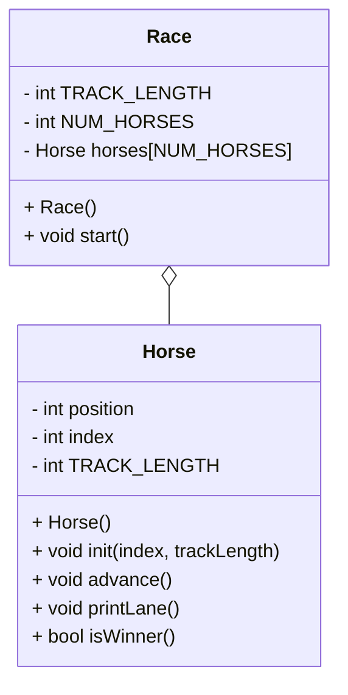

# OOP HorseRace Documentation

## UML diagram


## Race Class
*Race()*
```
  in header
    const static int NUM_HORSES = 15;
    initialize the length of track
    initialize the array of horses
    
```

## Horse Class
*Horse()*
```
  in header
    initialize the postion variable
    intialize the index variable
    intialize the lenght of track
    
```
